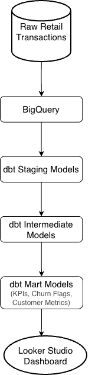
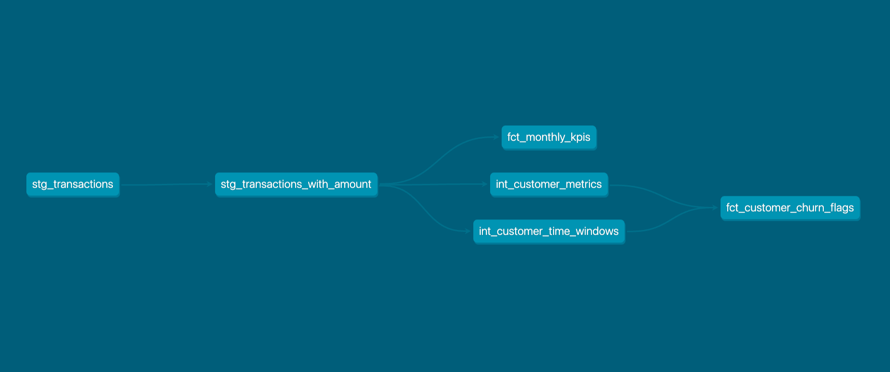
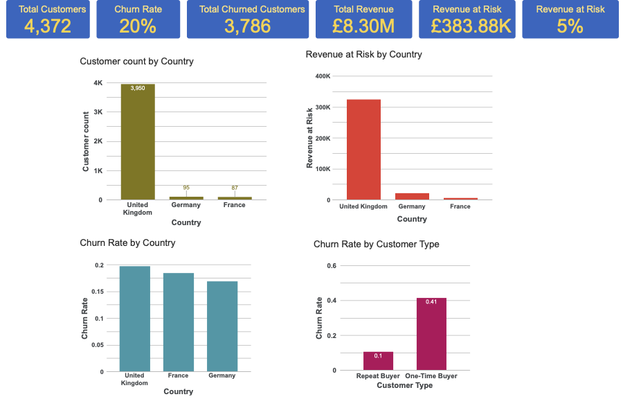
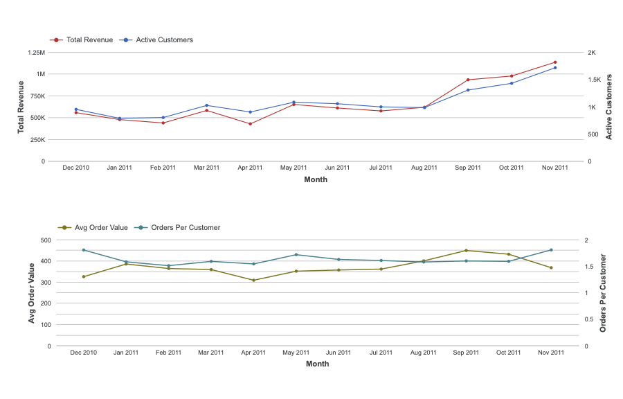

# Retail Customer Churn & Revenue Analysis (dbt + BigQuery + Looker Studio)

This project analyzes transactional data from a UK-based online retail company selling all-occasion gifts (many customers are wholesalers).

Objective:
- Understand revenue trends
- Identify churn patterns
- Diagnose drivers of customer drop-off
- Build foundation for ML-based churn prediction

## Data Architecture

## Data Modeling Approach
Layered dbt architecture:
- staging → cleaned transactional data
- intermediate → customer-level metrics
- marts → business KPIs & churn flags

## Dashboard Overview
### Page 1 — Churn Overview
- Overall churn rate
- Churn by country
- Customer type segmentation

### Page 2 — Revenue Diagnostics
Monthly revenue trend
- Active customers
- Average order value (AOV)
- Orders per active customer

## Key Insights
- Customer churn rate of 20% resulting in revenue risk of 5% amounting to £384K.
- High churn concentration observed in UK, France and Germany.
- Large portion of customers are one-time buyers, impacting retention stability.
- Revenue decomposition analysis to identify shifting Q4 growth drivers identified a high-margin surge in Sept/Oct (driven by Average Order Value) against a high-volume spike in November (driven by order volume).

